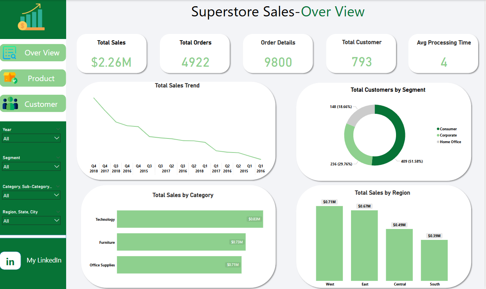
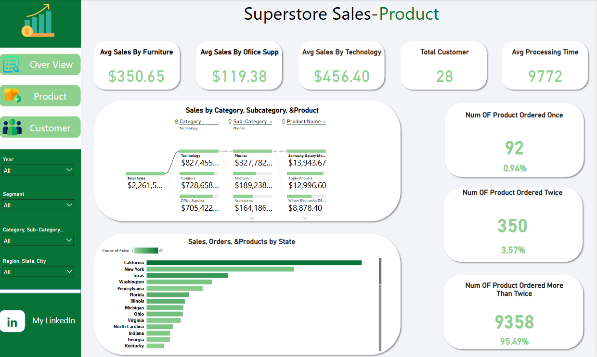
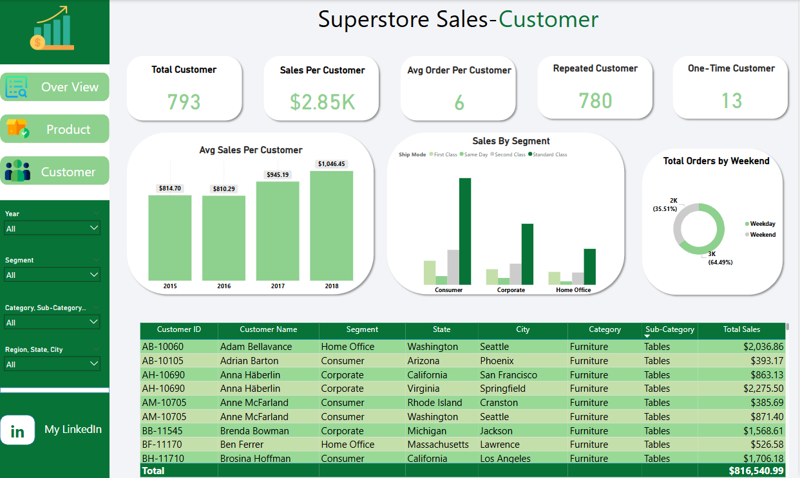

# Superstore Sales Analysis

This repository contains a Power BI dashboard that analyzes sales data from a Superstore dataset. The analysis is split into three main dashboards:

- Overview
- Product
- Customer

---

## Overview Dashboard

### Key Metrics:
- Total Sales: $2.26M  
- Total Orders: 4,922  
- Order Details: 9,800  
- Total Customers: 793  
- Avg Processing Time: 4 days  

### Charts Explained:
- Total Sales Trend: Line chart showing decreasing trend from Q4 2018 to Q1 2016.
- Total Sales by Category: Technology leads with $0.83M, followed by Furniture and Office Supplies.
- Total Sales by Region: West region performs best ($0.71M), followed by East, Central, and South.
- Customer Segments: Consumer is the largest segment (51.58%), then Corporate and Home Office.

---

## Product Dashboard

### Key Metrics:
- Avg Sales by Furniture: $350.65  
- Avg Sales by Office Supplies: $119.38  
- Avg Sales by Technology: $456.40  
- Total Customers in this view: 28  
- Avg Processing Time: 9,772 seconds  

### Charts Explained:
- Sales by Category, Subcategory & Product: Technology tops with $827K; top products include Samsung Galaxy and iPhone 5.
- Sales, Orders & Products by State: California dominates in total product count and sales.
- Order Frequency Analysis: 95.49% of products were ordered more than twice, showing repeat demand.

---

## Customer Dashboard

### Key Metrics:
- Total Customers: 793  
- Sales Per Customer: $2.85K  
- Avg Orders Per Customer: 6  
- Repeated Customers: 780  
- One-Time Customers: 13  

### Charts Explained:
- Avg Sales per Customer (by Year): Shows growth from $814.70 (2015) to $1,046.45 (2018).
- Sales by Segment & Ship Mode: Consumer segment leads; Standard & Second Class shipping modes dominate.
- Orders by Weekend vs Weekday: 64.49% on weekdays, 35.51% on weekends.
- Customer Table: Detailed view of top customer data, including state, segment, and total sales.

---

## Files Included

- `Superstore Sales Dataset.csv` — raw data.
- `superstore.pbix` — Power BI file.
- Dashboard screenshots: `OverView.png`, `Product.png`, `Customer.png`
- PDF Report: `Superstore Sales Analysis.pdf`

---
## 🔗 Connect with Me

ziadhani005@gmail.com

https://www.linkedin.com/in/ziad-taha-/

